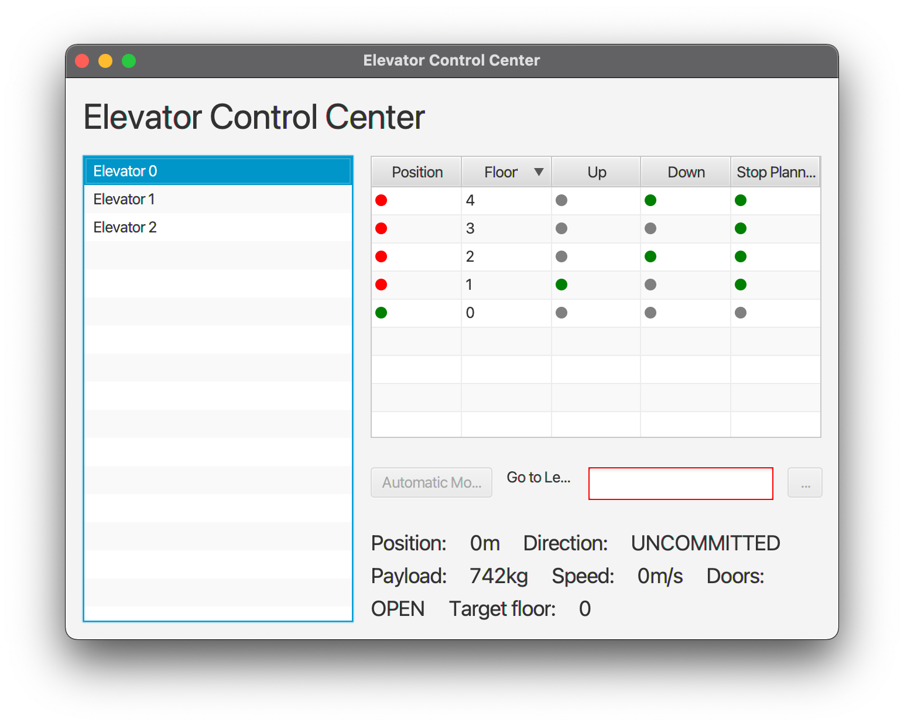
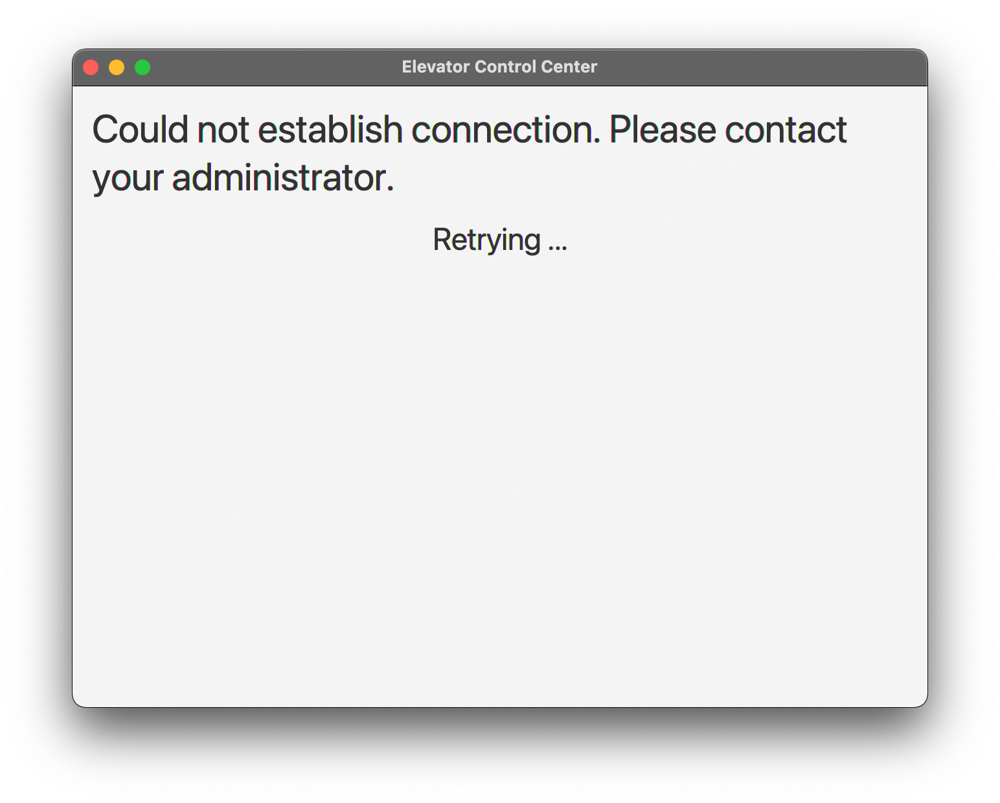

# Elevator Control Center GUI Team B

## Brief
A GUI for the Elevator Simulator connected via RMI.
The GUI enables the user to check the status of all elevators and manually control them.
Status updates from the simulated elevator buttons (eg. people pressing the "call" button) will be automatically updated in the GUI.
You can operate the elevators and see the detailed status of each elevator.

## Screenshots

### Connected to Simulator
On the left side, all elevators are listed. On the right side, the floors and the status for the selected Elevator.
"Automatic Mode" Button is disabled (not implemented yet).
With "Go to level", you can choose the target level for the selected elevator.

### Simulator not connected
When the RMI Connection could not be established, this Screen is shown.

## Install and run

### Prerequisites

- [x] Java SE/JDK 13 or higher
- [x] Latest Elevator Simulator `rmi-controller-*.jar` from [here](https://github.com/winterer/elevator/releases/latest).

### Launch GUI

- [x] Download `.jar` File from [latest release](https://github.com/fhhagenberg-sqe-esd-ws21/elevator-control-center-team-b/releases/latest).
- [x] Launch Simulator and start simulation
- [x] Launch GUI

## Development

### Prerequisites

- [x] Java 13 SDK (e.g. Oracle or OpenJDK).
- [x] Maven 3. (If you use an IDE like Eclipse or IntelliJ, Maven is **already included**.)
	- see http://maven.apache.org/install.html
- [x] An IDE or code editor of your choice.
- [x] Additional dependencies will be installed automatically based on `pom.xml`

### Instructions

1. Import this git repository into your favourite IDE.
2. Run application with `mvn clean javafx:run`.
3. Run Tests `mvn javafx:test`.

### Create a new Executable
1. Make sure all tests and SonarCloud Metrics pass!
2. Package the Application with `mvn clean package`.
3. The resulting archive (`.jar` file) is in the `target` directory.

## Contribution

### Guidelines
- CI + Automated test execution done with github [workflows](.github/workflows/maven.yml)
- Code coverage and static analysis done with [SonarCloud](https://sonarcloud.io/dashboard?id=fhhagenberg-sqe-esd-ws21_elevator-control-center-team-b)
- Use branches + Pull Requests, no direct commits to master branch allowed!

### Test concept
The following testing techniques were taken into account, to make sure that best code quality will be assured.
- Unit Tests (White Box) for the Model classes.
- Mocking Objects to mock dependencies (eg. Observer Pattern in Model, RMI Interface).
  - using [Mockito](https://site.mockito.org) and custom Mock objects
- Backend Tests to check if the RMI Wrapper behaves correctly.
- Connection Tests with Mocking and simulating RMI Exceptions to ensure that the GUI behaves correctly in exceptional situations.
- GUI Tests:
  - all GUI-Tests done with the [TestFx](https://github.com/TestFX/TestFX) framework.
  - Basic View-Model tests, used to check if updates are forwarded to GUI and actions have an impact on the GUI.
  - Manual testing (experience based testing)
- End-to-End tests: To make sure that the commands from the GUI and the status updates from the simulator triggers the right action either on the Frontend or Backend, End-to-End tests are used.

- [x] All tests written with [JUnit 5](https://junit.org/junit5/).
- [x] Static code analysis and Coverage metrics from [SonarCloud](https://sonarcloud.io/dashboard?id=fhhagenberg-sqe-esd-ws21_elevator-control-center-team-b) are used to analyze the overall quality of the tests.

### Metrics (SonarCloud)

### Contributors
- Daniel Windhager ([s2010567009](mailto:s2010567009@students.fh-hagenberg.at))
- Johannes Gurtner ([s2010567012](mailto:s2010567012@students.fh-hagenberg.at))
- Thomas Thaller ([s2010567026](mailto:s2010567026@students.fh-hagenberg.at))
